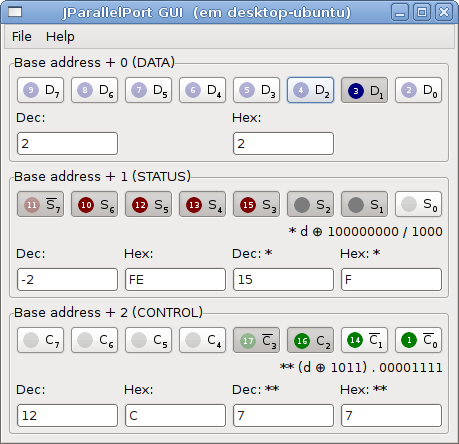

# Parallel Port
Legacy parallel-port project previously published on Coogle Code.
Parallel-port provides a portable API for C++ and Java to get raw access to the parallel port on IBM/PC based machines.

For GNU/Linux systems ParallelPort API uses parport driver, that usually comes with linux kernel (find out /dev/parport0).

For Windows 32 the access is done due the Inpout32 library. I din't find concise information about its licence, but I read that it's free for non comercial using only (in the Project Site).

I read that the Inpout32 don't work under Windows 64 bit editions and unfortunately I don't have a 64-bit machine with parallel port to evaluate, but I saw that exists something like Inpout64 to solve this problem.

C++ usage code example: 

```cpp 
ParallelPort parport; // instantiate ParallelPort object 

try { 
    parport.open(); // open port

    // write 0 value to data pins (usually 0x378) put all pins to low
    parport.writeData(0);

    //write 0 value to control pins (usually 0x37a) put C0, C1 and C3 to high
    //and C2 to low
    parport.writeControl(0);

    //read from status and print it as an integer
    cout << "Status: " << (int) parport.readStatus() << endl;

    parport.close(); // close port
} catch (runtime_error& e) { 
    cout << "Error: " << e.what() << endl; 
}
``` 

And almost the same code in Java (using j-parallel-port): 

```java
JParallelPort parport = new JParallelPort(); // instantiate ParallelPort object 

try { 
    parport.open(); // open port

    // write 0 value to data pins (usually 0x378) put all pins to low
    parport.writeData((byte) 0);

    // write 0 value to control pins (usually 0x37a) put C0, C1 and C3
    // to high
    // and C2 to low
    parport.writeControl((byte) 0);

    // read from status and print it as an integer
    System.out.println("Status: " + (int) parport.readStatus());

    parport.close(); // close port
} catch (IOException e) { 
    System.out.println("Error: " + e.getMessage()); 
} 
```

I have also written a GUI in Java (w/ SWT) to help me when a have to get or put data on a external hardware:


